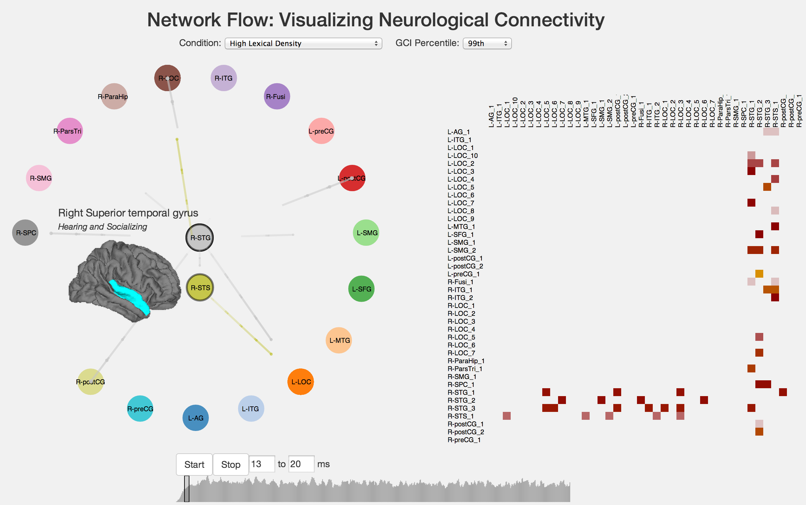

Network Flow: Visualizing Neurological Connectivity
===============
Yang Chaoyu, Aniket Handa, Gregory Nelson, A Conrad Nied {chaoyu, aniket, glnelson, anied}@uw.edu

<Add abstract here>

[Poster](https://github.com/CSE512-14W/fp-chaoyu-aniket-glnelson-anied/raw/master/final/poster-chaoyu-aniket-glnelson-anied.pdf)

[Final Paper](https://github.com/CSE512-14W/fp-chaoyu-aniket-glnelson-anied/raw/master/final/paper-chaoyu-aniket-glnelson-anied.pdf) 

## Running Instructions

Access our visualization at http://cse512-14w.github.io/fp-chaoyu-aniket-glnelson-anied/index.html or download this repository and run `python -m SimpleHTTPServer 9000` and access this from http://localhost:9000/.

### Operation

* Click on nodes to move them
* Brush over nodes to highlight them (show activity coming from specific nodes)
* Press start to play data
* While stopped, brush on the timeline to change start time and duration
* Changes the datasets

## Division of Labor

Each member took part in writing code and designing the system. To break it down by focused contribution:

Chaoyu: Coding lead
Aniket: Progress report, Coding
Greg: Literature review, deliverables
Conrad: Dataset, Matlab coding, deliverables
